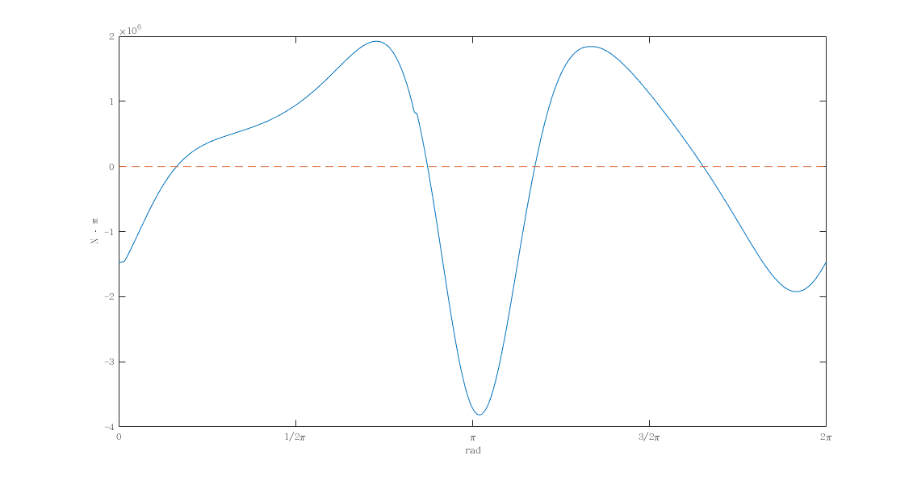

# Machine Dynamics - Assignment 2

Student ID: D08522005

Student Name: 張元

## Q1

**When $\theta_2$ varies from 150 to 240 degree, a constant loading 20 Nm is applied on Link 4 in the direction
opposite to its motion. Design a flywheel attached on Link 2. Consider only the kinetic energy change of
Link 2 and set the coefficient of fluctuation $k = 0.05$. Find the moment of inertia I of the flywheel and
analyze the change of the control input and reaction force on Link 2, and the changes of the shaking force
and shaking moment.**

Input torque without flywheel:

Mean value of the torque: $T_{avg} = -5316.8$ Nm

And the $\theta@\omega_{min} = 2.7417$ rad, $\theta@\omega_{max} = 3.6935$ rad.

Let motor torque $T_M = T_{avg}$.

$$
\int_{\theta@\omega_{min}}^{\theta@\omega_{max}}T_L - T_{avg} d\theta = \frac{1}{2} I(\omega_{max}^2 - \omega_{min}^2)
$$

The coefficient of fluctuation:

$$
\begin{aligned}
\omega_{min} &= 1.4623 \times 10^8
\\
\omega_{max} &= -3.2124 \times 10^8
\\
k &= \frac{\omega_{max} - \omega_{min}}{\omega_{avg}} = 0.05
\\
\omega_{avg} &= -9.3495 \times 10^9
\end{aligned}
$$

$$
\Delta E = \frac{1}{2} I(2\omega_{avg})(\omega_{max} - \omega_{min}) = I\omega_{avg}(\omega_{max} - \omega_{min}) = -2.7063 \times 10^6
$$

Obtianed the inertia of the flywheel:

$$
I = \frac{\Delta E}{k\omega_{avg}^2} = -6.1919 \times 10^{-13}
$$

## Q2

**Please use the linkage balance method from the textbook to adjust the parameters (but the length must
be fixed) of the links. Find the change of location of the CG of the four-bar linkage and analyze the control
input and reaction force on Link 2, and also the changes of the shaking force and shaking moment.**

$$
\begin{aligned}
m_t &= m_2 + m_3 + m_4
\\
m_t\vec{R_t} &= m_2\vec{R_2} + m_3\vec{R_3} + m_4\vec{R_4}
\end{aligned}
$$

The location of each center of gravity shown as below,
where $\theta_i$ is the angle from x axis to the link;
and $\phi_i$ is the angle from link to its CG.

$$
\begin{cases}
\vec{R_2} &= |\vec{R_2}|e^{j(\theta_2 + \phi_2)}
\\
\vec{R_3} &= \overline{AB}e^{j\theta_2} + |\vec{R_3}|e^{j(\theta_3 + \phi_3)}
\\
\vec{R_4} &= \overline{AD}e^{j\theta_1} + |\vec{R_4}|e^{j(\theta_4 + \phi_4)}
\end{cases}
$$

$$
\begin{aligned}
m_t\vec{R_t} =& m_2(|\vec{R_2}|e^{j(\theta_2 + \phi_2)})
\\
&+ m_3(\overline{AB}e^{j\theta_2} + |\vec{R_3}|e^{j(\theta_3 + \phi_3)})
\\
&+ m_4(\overline{AD}e^{j\theta_1} + |\vec{R_4}|e^{j(\theta_4 + \phi_4)})
\\
=& m_4\overline{AD}e^{j\theta_1}
\\
&+ (m_2|\vec{R_2}|e^{j\phi_2} + m_3\overline{AB})e^{j\theta_2}
\\
&+ (m_3|\vec{R_3}|e^{j\phi_3})e^{j\theta_3}
\\
&+ (m_4|\vec{R_4}|e^{j\phi_4})e^{j\theta_4}
\end{aligned}
$$

Vector loop:

$$
\overline{AB}e^{j\theta_2} + \overline{BC}e^{j\theta_3} - \overline{CD}e^{j\theta_4} - \overline{AD}e^{j\theta_1} = 0
$$

Derived as:

$$
\begin{aligned}
m_2|\vec{R_2}|e^{j\phi_2} &= m_3(|\vec{R_3}|\frac{\overline{AB}}{\overline{BC}}e^{j\phi_3} - \overline{AB})
\\
m_4|\vec{R_4}|e^{j\phi_4} &= -m_3|\vec{R_3}|\frac{\overline{CD}}{\overline{BC}}e^{j\phi_3}
\end{aligned}
$$

Bring the fixed paramters into the formula: (in $\theta_2=\frac{\pi}{2}$)

$$
\begin{cases}
|\vec{R_3}| &= 0.4242
\\
\phi_3 &= 2.351
\end{cases}
$$

$$
\begin{aligned}
|\vec{R_2}|e^{j\phi_2} &= -0.5315 + 0.335j
\\
0.2|\vec{R_4}|e^{j\phi_4} &= 0.8288 - 0.8375j
\end{aligned}
$$
