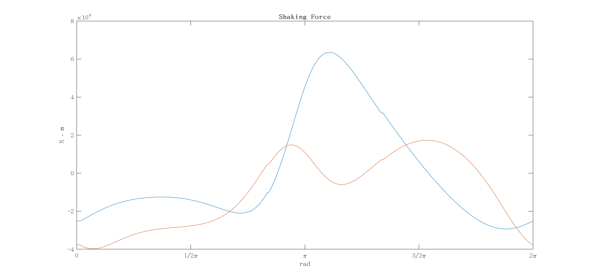
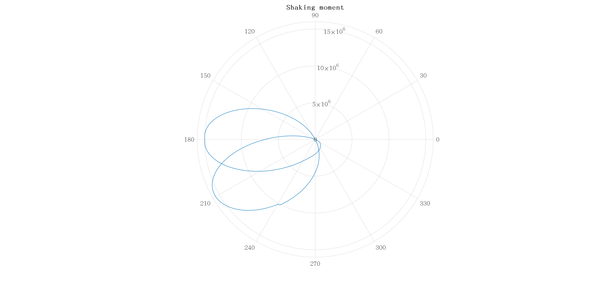

# Machine Dynamics - Assignment 1

Student ID: D08522005

Student Name: 張元

## Part I

### Q2 Statics

**Calculate the reaction forces at all joints and the required torque on Link 2 to
achieve static balance when $\theta_2$ is equal to 90 degree. List all the data in a table.**

| Joint | Reaction Force ($N$) | Required Torque ($N \cdot m$) |
|:-----:|:--------------------:|:-----------------------------:|
| A | 1035.4742 | 0 |
| B | 1036.2480 | 0 |
| C | 1036.5765 | 0 |
| D | 1044.4153 | 0 |

## Part II

### Q3 Kinetostatics

**Calculate the reaction force at all joints and the required torque on Link
2 when $\theta_2$ varies from $\theta$ to 360 degree (interval $\le 1$ degree). Take the angle of Link 2 ($\theta_2$)
as the horizontal axis to draw plots for these variables.**

The reaction forces of each joint splitted with x and y axis: (Ja ~ Jd)

The required torque on Joint A:

### Q4

**Continued from 3, draw (a) the plots of the x and y components of the shaking force
with $\theta_2$ as the horizontal axis, and (b) the polar plots of the shaking force and shaking moment.**

The shaking force is composed by Joint A and Joint D based on the frame.

The polar plot of shaking force. (Composed)

The shaking moment can be obtained by $M_S = \overrightarrow{R_1} \times \overrightarrow{F_{41}} + \overrightarrow{T_{21}}$.

#### a.

**What is the maximum input torque? When does it happen? Use degree as the
unit and be accurate to 2 decimal places.**

According to the torque of Joint A,
the extremum of input torque is $3.8172 \times 10^6$ $N \cdot m$ at $\theta_2 = 183.9195$ deg.

#### b.

**What are the maximum shaking force and shaking moment? When do they
happen? Use degree as the unit and be accurate to 3 decimal places.**

According to the polar plot,
the maximum shaking force is $57694.7620 N$ at $\theta_2 = 199.6040$ deg;
the maximum shaking moment is $1556.5653 \times 10^4$ $N \cdot m$ at $\theta_2 = 209.5842$ deg.
